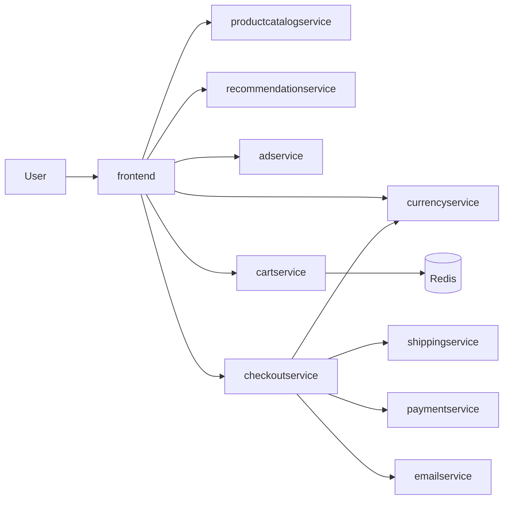
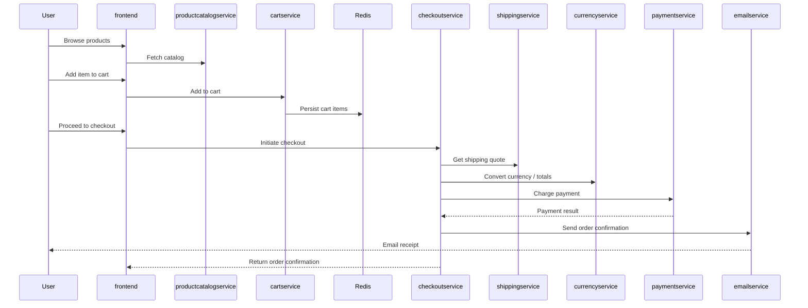

# Microservices E‑Commerce Architecture (Mermaid)

This document provides well-structured Mermaid diagrams that capture the full architecture of the project: infrastructure, CI/CD, runtime topology, and the checkout flow.

## Infrastructure & CI/CD
```mermaid
flowchart TB
  %% External actors & tools
  user[User]
  dev[Developer]
  git[GitHub Repository]
  jenkins[Jenkins CI/CD]
  ecr[ECR Registry]
  argocd[Argo CD]

  %% AWS & EKS
  subgraph AWS[Amazon Web Services (us-east-1)]
    route53[Route 53]
    alb[ALB/NLB]
    subgraph EKS[Amazon EKS Cluster]
      subgraph ns_app[Namespace: app]
        fe[frontend (Service: LoadBalancer)]
        pc[productcatalogservice]
        cs[cartservice]
        co[checkoutservice]
        cu[currencyservice]
        ps[paymentservice]
        sh[shippingservice]
        em[emailservice]
        rc[recommendationservice]
        ad[adservice]
        lg[loadgenerator]
        redis[(Redis)]
      end
      subgraph ns_mon[Namespace: monitoring]
        prom[Prometheus]
        graf[Grafana]
        am[Alertmanager]
      end
    end
  end

  %% Dev & CI/CD
  dev --> git
  git --> jenkins
  jenkins -->|Build, Test, Scan| ecr
  jenkins -->|Update image tags in kubernetes-files/*.yaml| git
  ecr -->|Images| EKS
  argocd -->|Sync manifests| EKS

  %% Traffic flow
  user --> route53 --> alb --> fe

  %% Observability
  EKS -.scrapes.-> prom --> graf
  am -.alerts (email/slack).-> dev
```

## Runtime Service Topology


## Checkout Sequence


## Notes
- `frontend` is exposed via a Kubernetes `Service: LoadBalancer` behind `Route 53` + `ALB` for public access.
- `cartservice` persists state in `Redis` (see `kubernetes-files/redis-cart.yaml`).
- All microservices are stateless Deployments with `Service (ClusterIP)` for internal communication.
- CI/CD pipelines in `jenkisfiles/<service>` build, scan, push to `ECR`, and update manifests in `kubernetes-files/`.
- Observability runs in the `monitoring` namespace with Prometheus, Grafana, and Alertmanager.